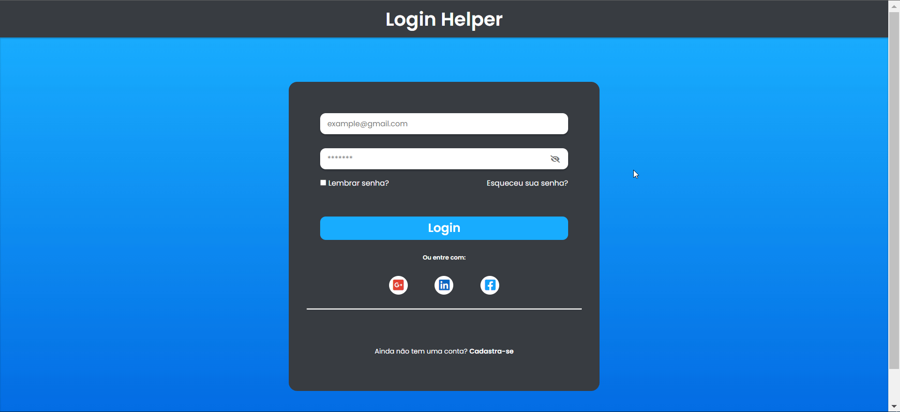

<h1 align="center">
Login Helper</h1>
 

 

   <cite align="center"><i>`Tela com um formulário para login`</i></cite>

<h1 align="center">
    
</h1>
 

## 🚀 Tecnologias

Esse projeto foi desenvolvido com as seguintes tecnologias:

- HTML
- CSS
- JavaScript

### Utilitarios

-  Curso da Udemy **[HTML5, CSS3 e Javascript na prática (3 Projetos)](https://www.udemy.com/course/html5-css3-e-javascript-na-pratica-3-projetos/)**
-  Editor: **[Visual Studio Code](https://code.visualstudio.com/)**
-  Fontes: **[Ubuntu](https://fonts.google.com/specimen/Ubuntu)**
